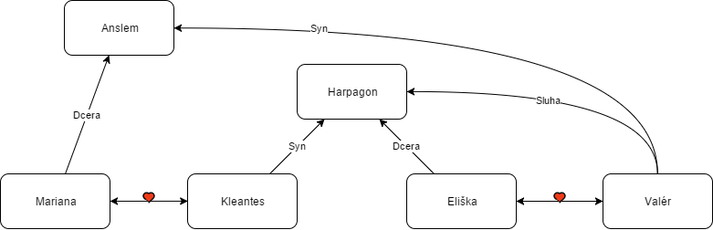

# Moliére - Lakomec

----------

## Dílo

### Téma a motiv
Autor se poukazuje, jak může člověka zničit chamtivost a kritizuje chorobnou touhu po penězích

-	obraz lichváře Harpagona,který si myslí, že má obrovskou moc a ovlivňuje životy jiným
-	hlavním námětem je lakota
-	pro peníze obětuje cokoliv
-	postava Harpagona vžitá do přísloví
-	obraz života Pařížanů v 17. století
-	tímto dílem odkazuje, že peníze mění charakter a mezilidské vztahy
-	inspirace Komedií o hrnci od římského dramatika Plautuse

### Místo a čas
Paříž v roce 1670

### Kompozice
divadelní hra o pěti dějstvích
chronologická

### Literární druh a žánr
- klasicistní drama
	- kritika společnosti a zkaženosti světa
	- dodržení jednoty místa, času a děje
- komedie

### Jazykové prostředky
- psáno er-formou
- živé dialogy plné hovorových obratů, zejména u Harpagonova služebnictva
- mnohdy najdeme anaforu (**opakování stejného slova** či skupiny na začátku vět či veršů)
- často satirický tón, ironie, nadsázka
- stylistické rozvrstvení slovní zásoby (např. citové zabarvení - zejména když Harpagon hovoří o penězích)
- psáno spisovným jazykem X občasné vulgarismy
- figury a tropy
- metafory

### Postavy
- Harpagon
	- šedesátiletý vdovec
	- lichvář
	- slepě touží po penězích
	- lakomý, panovačný
	- trpí jeho děti i služebnictvo
	- bohatství je pro něj důležitější než vlastní život a rodina
	- sám si chce vzít Marianu
- Kleantes
	- Harpagonův syn
	- nechápe otcovu posedlost penězmi
	- zamilován do Mariany (po ní touží i sám Harpagon), i když byla velice chudá
	- chytrý, podnikavý
- Mariana
	- velmi krásná dívka
	- miluje Kleanta
	- vede tichý život po boku své matky
- Eliška
	- Harpagonova dcera
	- zamilovaná do Valéra
	- nechce si vzít muže, kterého jí vybral otec
- Valér
	- Harpagonův sluha
	- syn Alsemův
	- zamilovaný do Elišky
	- úlisný slídil aby se zalíbil Harpagonovi
	- donáší na služebnictvo
- Anselm
	- bohatý šlechtic
	- na konci hry se ukáže, že je to otec Valéra a Mariany
- La Fléche (Čipera)
	- Kleantův sluha
- Frosina
	- dohazovačka
	- nakonec pomůže Klentesovi

### Děj
Příběh se odehrává v Paříži roku 1670. Pojednává o životě lakomce Harpagona. Harpagon žije v domě se svými dvěma dětmi - Kleantem a Eliškou. Všichni o něm ví, že je velice bohatý, ale zároveň lakomý a pomlouvá ostatní. Jeho největší starostí je, aby dětem nemusel dávat k svatbě věno, ale aby jej dostaly ony. Tyto pomluvy jeho dětem ztěžují společenský život.
Když se Eliška zasnoubí s Valérem, má oprávněné obavy, že otec jejich svatbě nepožehná. Proto se se svými úmysly nejprve rozhodne svěřit svému bratru Kleantovi. Ten se jí na oplátku svěří se svým trápením. On sám je také zamilovaný do chudé, ale velmi krásné dívky Mariany a chce si ji vzít.

Ani jednomu z nich se však do přiznávání svých citů otci nechce. Mají totiž strach z jeho reakce. Nakonec se rozhodnou, že za otcem půjdou společně. Ten o svatbě začne hovořit sám. O Marianě mluví pěkně a potěší ho, že mu jeho syn dá za pravdu v tom, že by z ní byla dobrá manželka. Poté vyjde najevo, že Harpagon celou dobu mluví o tom, že on sám si chce Marianu vzít. Na tuto myšlenku přivedla Harpagona dohazovačka Frosina, která pomocí různých úskoků, dvojsmyslných vět a chlácholivých monologů přesvědčí Harpagona, že jej Mariana miluje.

Celá situace se stává pro Harpagonovy děti ještě více nešťastnou, když jim jejich otec oznámí, že pro ně také našel vhodné protějšky. Pro svou dceru Anselma, velice bohatého staršího pána, a pro Kleanta bohatou vdovu.
Když se Frosina dozví, že Mariana miluje Kleanta, rozhodne se mladému páru pomoci. Plánuje s dívkou, jak se lakomce zbavit. Roli v tom hraje také fakt, že jí Harpagon za její předešlé dohazovačské služby nezaplatil.
Kleant se rozhodne jednat sám. Podepíše nevýhodný obchod s neznámým lichvářem, ze kterého se nakonec vyklube jeho otec, jehož tím nesmírně rozčílí.

Dojde k hádce mezi Kleantem a Harpagonem, při níž tedy vyjdou najevo Kleantovy city k Marianě, po které touží oba.
Zoufalý Kleant odchází do zahrady, kde se střetne se svým sluhou Štikou. Štika během jejich hádky nejde pohádkový poklad - truhličku s penězi, kterou Harpagon ukrýval v zahradě a později ji předá Kleantovi. Harpagon ale brzy přijde na to, že mu poklad chybí. Rozzuří se a přivolá komisaře. Rozhodne se vyslechnout celou rodinu i služebnictvo. Jakub obviní ze zlosti Valéra, jenž ho v hádce kvůli přípravě večeře uhodil.

Harpagon tedy vyslechne správce Valéra. Při výslechu však dojde k nedorozumění - Valér si myslí, že ho Harpagon obviňuje nikoliv z krádeže, ale z lásky k Elišce, a tak se ke všemu přizná. Harpagon je vzteky bez sebe. Chce nechat Valéra popravit.

Ještě ten samý večer má dojít k slavnostní večeři, na níž Harpagon pozval jak svou nastávající Marianu, tak Anselma, kterého určil za ženicha své dceři. Po příchodu pana Anselma se všechno změní.
Valér přiznává, že je synem hraběte Tomase d'Alburci. On jediný přežil, když s celou rodinou ztroskotali na moři. To celé slyší Mariana a Alselm. Děj vyvrcholí přiznáním pana Anselma, který prozradí svůj skutečný původ. Ukáže se, že je ztraceným otcem nejen Valéra, ale i Mariany.

Kleant vrátí otci ukradené peníze s podmínkou, že se bude moci oženit s Marianou a Eliška s Valérem. Harpagon s vidinou navrácených peněz souhlasí, a vlastně na tom vydělává: svatební výlohy a náklady za vyšetřování bude platit Anselm. Harpagon je spokojen a zůstává sám se svými penězi.

## Literárně-historický kontext

### Kontext Autorovy tvorby
- autor 33 komedií
- autor se narodil v Paříži v 17. století
- ředitel královského divadla v Paříži
- konflikt s církví
- navazoval na tradici francouzské frašky
- psal odvážné veselohry, kde kritizoval a zesměšňoval církev i šlechtu a morálku
- odsuzoval pokrytectví
- jeho hry byly nadčasové a jsou stále oblíbené
- další Moliérova díla
	- Tartuffe (proti církvi)
	- Škola žen

### Literární / kulturní kontext
Ve své době se Lakomec nesetkal s úspěchem u diváků, protože předstihl svými pokrokovými názory dobu X v současnosti stále nejvíce hraná francouzská komedie.
Taktéž se neuchytila, protože byla psána formou prózy.

## Ukázka
> **++Výstup 3.++**
> *Harpagon, La Flèche*
> **HARPAGON**: Kliď se hned a bez odmluvy! Táhni odsud, zapřísáhlý darebo a šibeničníku!
> **LA FLÈCHE ** *(stranou)* : Co jsem živ, neviděl jsem tak zlého člověka jako tento proklatý dědek, a já myslím, ten má jistě čerta v těle!
> **HARPAGON**: Co to huhláš mezi zuby?
> **LA FLÈCHE**: Proč mne vyháníte?
> **HARPAGON**: A ty se ještě ptáš, lotře, po důvodech? Rychle, kliď se, než tě zabiju.
> **LA FLÈCHE**: Co jsem vám udělal?
> **HARPAGON**: Tys udělal, že chci, abysi se klidil!
> **LA FLÈCHE**: Můj pán, váš syn, nařídil mi, bych jej očekával.
> **HARPAGON**: Jdi jej očekávat na ulici a ne v mém domě, kde stále stojíš vztýčen jako na stráži vyzvídaje, co se kde šustne a využitkuješ všecko! Nechci míti stále kol sebe špehouna svého počínání a zrádce, jehož proklaté oči sledují každý krok můj, hltají vše, co je mým, a čenichají na všech stranách, kde co se dá ukradnout!
> **LA FLÈCHE**: Rád bych věděl, jak vás někdo může okrásti? Což jste k okradení, když vše uzavíráte, a jste na stráži ve dne v noci?
> **HARPAGON**: Zavírám, co za dobré uznávám a stojím na stráži, jak se mi zlíbí. Což není stále dost špiclů okolo, kteří na vše pozor dávají? *(Stranou.)* Chvěji se, jestli jen nevypátral mé peníze? *(Nahlas.)* Či nerozkřikoval jsi po městě, že ukrývám doma peníze?
> **LA FLÈCHE**: Vy máte schované peníze?
> **HARPAGON** : Ne, ničemo, to jsem neřek! *(K sobě.)* Já se vzteknu! *(Nahlas.)* Ptám se jen, jestli jsi v své zlomyslnosti podobné
> řeči neroztrušoval?
> **LA FLÈCHE**: Hm, co mi po tom, máte-li peníze, nebo ne, to je mi pořád pět!
> **HARPAGON** *(zvedá ruku, by jej poličkoval)* : Ty ještě rozumuješ? Vytáhám ti za uši, a tím ukončím tvé rozumování. Kliď se odsud, naposled!
> **LA FLÈCHE**: Nu dobrá, – já jdu!