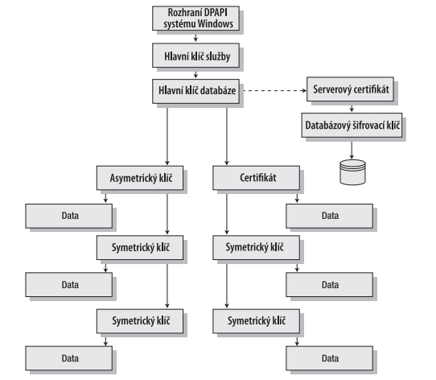

Hlavní **klíče databáze** se používají pro **zašifrování** symetrických klíčů, asymetrických klíčů
a certifikátů. Každá **databáze** může mít **jediný**, pro ni definovaný hlavní **klíč** databáze.
Další vrstva klíčů obsahuje symetrické klíče, asymetrické klíče a certifikáty. Symetrické klíče
jsou primární prostředky pro zašifrování dat v databázi. Zatímco asymetrické klíče a certifikáty
je možné použít k zašifrování dat (s trochou úsilí, kterému se budeme věnovat v sekci
„Asymetrické klíče“ dále v této kapitole), Microsoft doporučuje, abyste šifrovali data výhradně
s pomocí symetrických klíčů.

